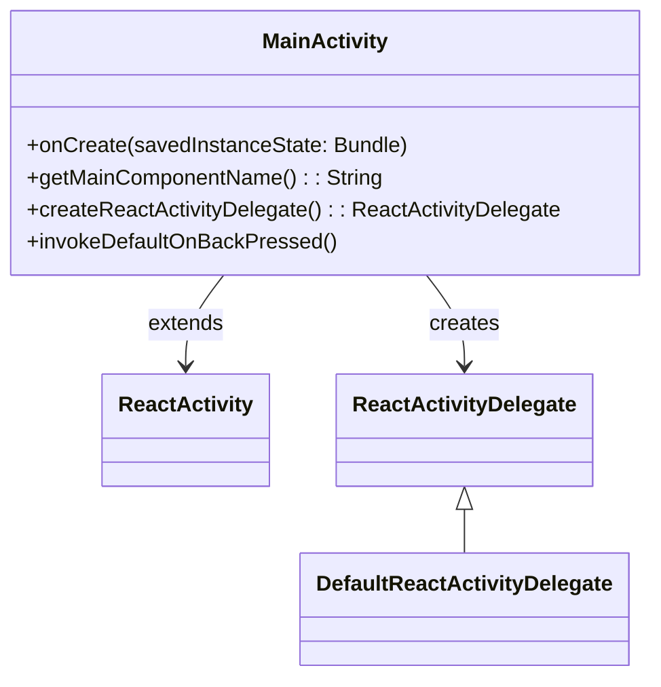
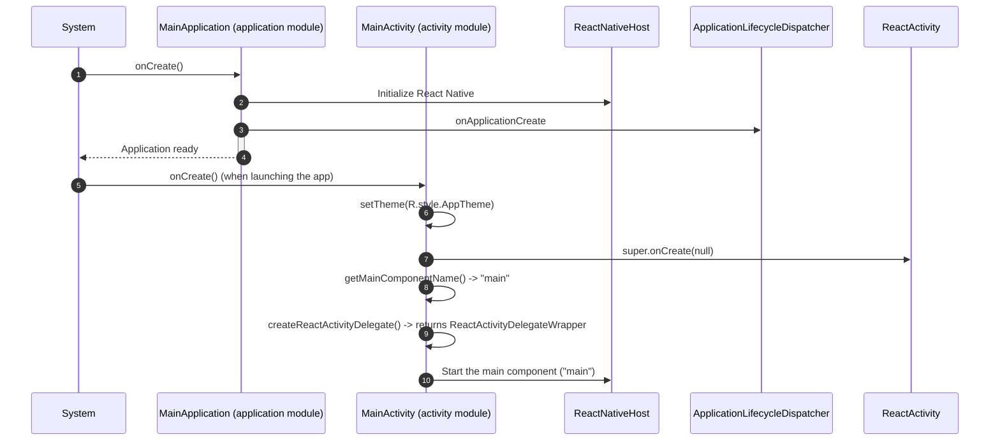

# Activity Module

## Introduction
The activity module contains the main entry point for the Android application, `MainActivity`, which extends `ReactActivity` to host the React Native application.

## Purpose and Core Functionality
The `MainActivity` is responsible for:
- Setting the application theme (`AppTheme`) before the activity is created to support coloring the background, status bar, and navigation bar (required for expo-splash-screen).
- Providing the main component name (`"main"`) to the React Native host for rendering.
- Creating a `ReactActivityDelegate` that is configured to enable the New Architecture (Fabric) based on the build configuration.
- Handling the back button press to align with Android S (API level 31) behavior by moving the task to the back for non-root activities on older Android versions, and using the default behavior on Android S and above.

## Architecture and Component Relationships
The `MainActivity` class is a simple Android activity that integrates with the React Native framework.

### Class Diagram
The following diagram shows the key relationships of the `MainActivity` class:

### Dependencies
- The activity module depends on the React Native framework (via `com.facebook.react.ReactActivity` and related classes).
- It uses the application module's build configuration (`BuildConfig`) to determine if the New Architecture is enabled.
- The activity module relies on the application module (`MainApplication`) to initialize the React Native host and manage the application lifecycle.

### Interaction with Application Module
The `MainActivity` works in conjunction with the `MainApplication` class (defined in the application module) to bootstrap the React Native application:
- The `MainApplication` class (in [application module](application.md)) sets up the `ReactNativeHost` and initializes React Native when the application starts.
- The `MainActivity` is launched by the Android system after the application is created, and it hosts the React Native instance initialized by the `MainApplication`.

## Integration with the Overall System
The activity module is the visible entry point of the application, while the application module manages the global application state and React Native host.
Together, they form the Android-specific bootstrap for the React Native application.

The typical launch sequence is as follows:

## References
- For details on the application module and its role in initializing React Native, see the [application module documentation](application.md).
- For more information on React Native activities and delegates, refer to the [React Native documentation](https://reactnative.dev/docs/activity).