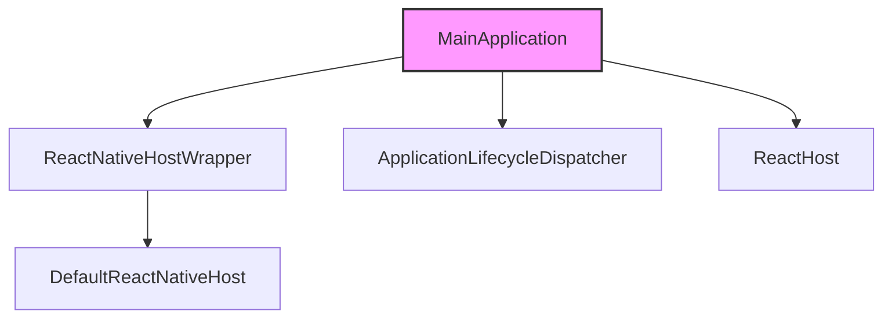
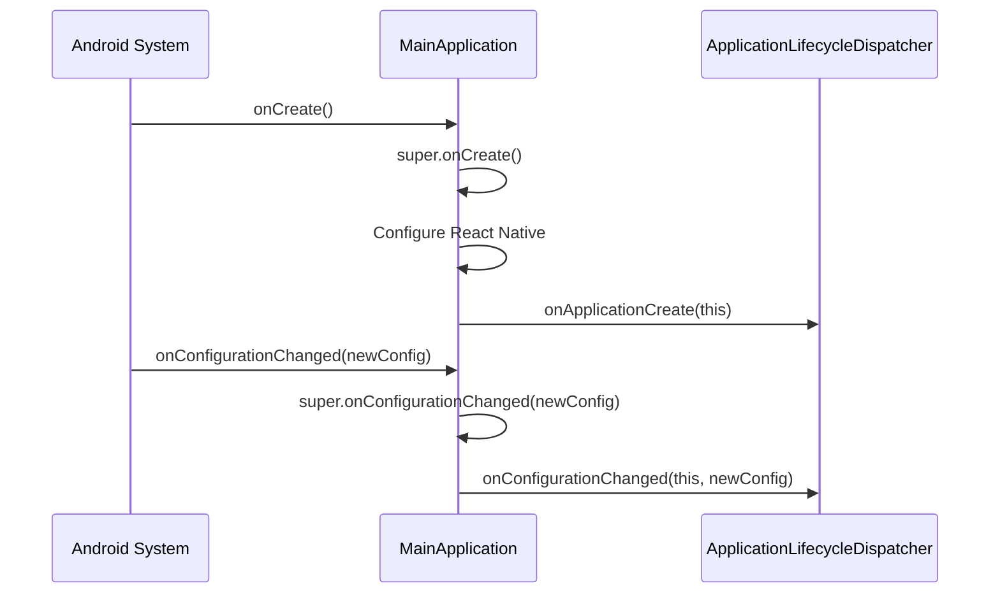

# MainApplication

## Introduction

The `MainApplication` class is the entry point of the Android application. It extends the Android `Application` class and implements the `ReactApplication` interface to integrate with React Native. This class initializes the React Native environment and manages application lifecycle events, serving as the bridge between the Android framework and the React Native runtime.

## Architecture

The `MainApplication` class is responsible for:
- Initializing the React Native host via `ReactNativeHostWrapper`
- Configuring React Native properties (JavaScript module name, developer support, architecture settings)
- Dispatching application lifecycle events to Expo modules via `ApplicationLifecycleDispatcher`
- Providing a `ReactHost` instance for React Native integration

Key architectural components:
- **ReactNativeHost**: Manages the React Native instance and JavaScript bundle loading
- **ApplicationLifecycleDispatcher**: Handles lifecycle event propagation to Expo modules
- **ReactHost**: Provides host functionality for React Native

## Component Details

### MainApplication

- **Package**: `com.ecosorter.ai`
- **Extends**: `android.app.Application`
- **Implements**: `com.facebook.react.ReactApplication`

#### Fields

| Field | Type | Description |
|-------|------|-------------|
| `reactNativeHost` | `ReactNativeHostWrapper` | Wraps a `DefaultReactNativeHost` with custom configurations for JS module name, developer support, and architecture settings |
| `reactHost` | `ReactHost` (read-only) | Created via `ReactNativeHostWrapper.createReactHost` using application context and `reactNativeHost` |

#### Methods

##### `onCreate()`
1. Calls `super.onCreate()`
2. Sets React Native release level from `BuildConfig.REACT_NATIVE_RELEASE_LEVEL` (defaults to `STABLE` on error)
3. Loads React Native via `loadReactNative(this)`
4. Notifies `ApplicationLifecycleDispatcher` of application creation

##### `onConfigurationChanged(newConfig: Configuration)`
1. Calls `super.onConfigurationChanged(newConfig)`
2. Notifies `ApplicationLifecycleDispatcher` of configuration change

## Interaction with Other Modules

The `MainApplication` class interacts with the `activity` module through the Android framework. Specifically, the `MainActivity` (defined in the `activity` module) is the main entry point for the user interface and is launched by the Android system. The `MainApplication` provides the global application context and initializes the React Native environment that the `MainActivity` uses to render the React Native UI.

For more details on the `MainActivity`, refer to the [activity module documentation](activity.md).

## Diagrams

### Component Architecture

The following diagram illustrates the key components and their relationships in the `MainApplication`:

### Lifecycle Event Flow

The following diagram shows how lifecycle events are handled:

## Conclusion

The `MainApplication` class is a critical component that bridges the Android application lifecycle with the React Native runtime, ensuring proper initialization and event handling. It delegates lifecycle management to Expo modules while providing the necessary configuration for React Native to function correctly within the Android ecosystem.