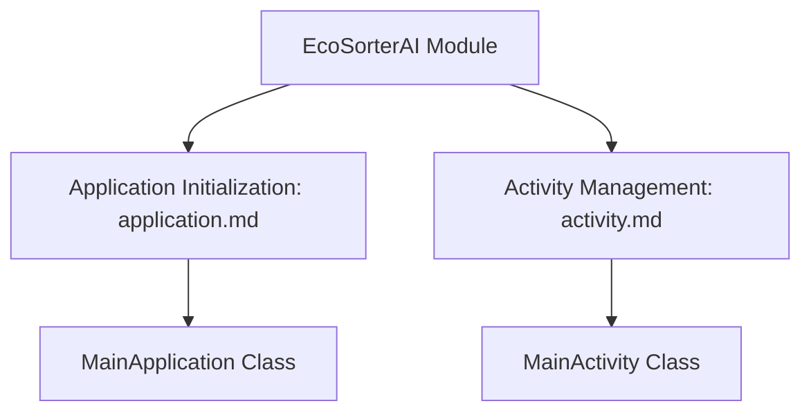
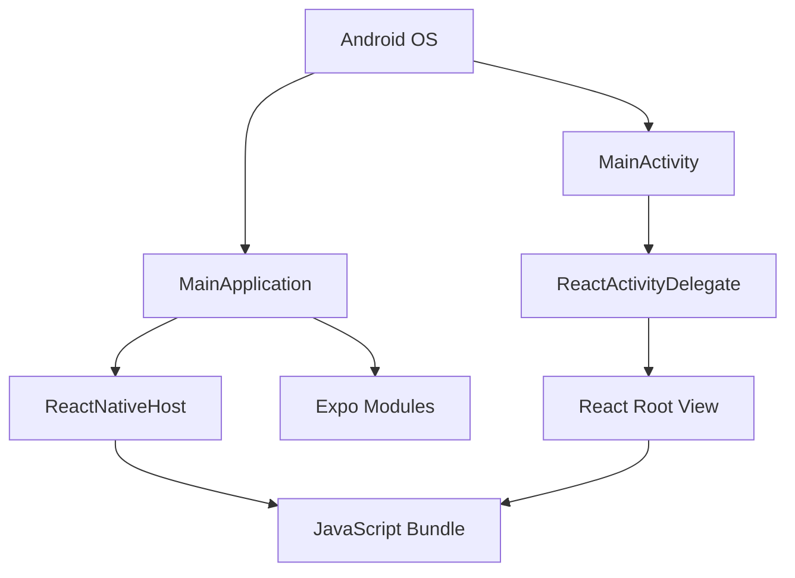

# EcoSorterAI Module

## Overview
The EcoSorterAI module is the Android application entry point for the EcoSorter AI-powered recycling assistant. It initializes the React Native framework and hosts the main JavaScript bundle that powers the application's user interface and business logic.

### Module Structure
The following diagram illustrates the relationship between the main module and its sub-modules:

## Architecture
The module consists of two primary components that work together to bootstrap the React Native application:

1. **MainApplication** - Application-level initialization and React Native host configuration
2. **MainActivity** - Activity-level entry point and UI hosting

These components follow the standard React Native Android architecture pattern, with the Application class managing global state and the Activity handling the UI lifecycle.

### Component Relationships

## Data Flow
1. Application startup triggers `MainApplication.onCreate()`
2. React Native is loaded via `loadReactNative()`
3. MainActivity is launched by Android OS
4. MainActivity creates ReactActivityDelegate to host React Native view
5. JavaScript bundle is loaded and renders the main component

## Sub-modules
- [Application Initialization](application.md) - Details about MainApplication
- [Activity Management](activity.md) - Details about MainActivity

## Integration Points
- **Expo Modules**: Integrated via `ApplicationLifecycleDispatcher` and `ReactNativeHostWrapper`
- **React Native**: Standard React Native initialization with support for new architecture
- **JavaScript Bundle**: Loads from `.expo/.virtual-metro-entry` during development

## Configuration
- Developer support enabled in debug builds
- New architecture toggle via `BuildConfig.IS_NEW_ARCHITECTURE_ENABLED`
- React Native release level configured via `BuildConfig.REACT_NATIVE_RELEASE_LEVEL`